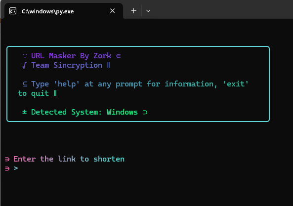
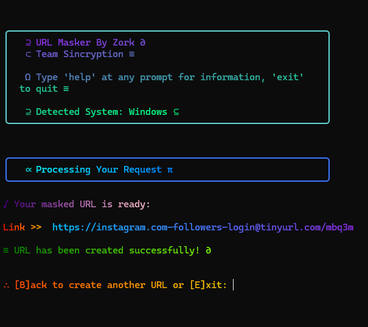

# URL Masker 




*Welcome screen and main interface*



*Final output with masked URL results*

<div align="center">


</div>

## Features

- **URL Shortening**: Automatically shortens long URLs using multiple services
- **URL Masking**: Creates deceptive URLs with custom domains
- **Multiple Shorteners**: Fallback to alternative services if one fails
- **Cross-Platform**: Works on Windows, Linux, MacOS, and Termux
- **Interactive Interface**: User-friendly terminal interface

## Installation

```bash
# Clone the repository
git clone https://github.com/samay825/URL-Masker.git

# Navigate to the directory
cd URL-Masker

# Install required packages
pip install -r requirements.txt
```

## Usage

```bash
# Run the program
python main.py
```

### Interactive Commands:
- Type `help` at any prompt to display help information
- Type `exit` at any prompt to quit the program
- Type `back` at the navigation prompt to create another URL

## Example

1. Enter your target URL
2. Specify the masking domain (e.g., facebook.com)
3. Add optional keywords
4. Get your masked URL

## Dependencies

- pyshorteners
- rich
- validators

## Disclaimer

This tool is for educational purposes only. The developers are not responsible for any misuse or damage caused by this program.

## Contributing

Contributions, issues, and feature requests are welcome! Feel free to check [issues page](https://github.com/samay825/URL-Masker/issues).

## 👨‍💻 Author

**Zork - Team Sincryption**

<div align="center">
  
</div> 
